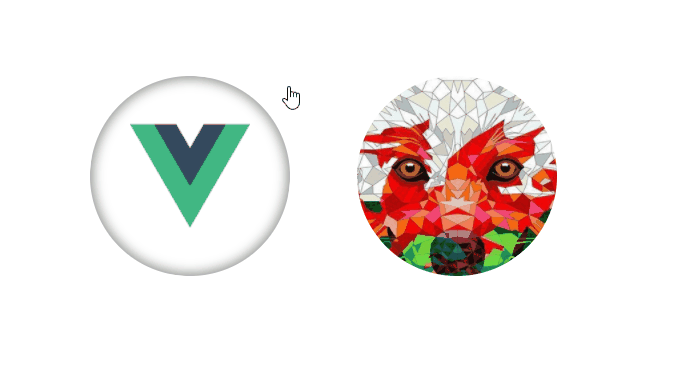

# vue-sticker

> vue component, that helps to make sticky effects

>> wait a few days please, i prepare a demo



## Installation

``` bash
# install component
npm install --save-dev vue-sticker
```

## using like local component
``` js
import VueSticker from 'vue-sticker'

...
    components: { VueSticker }
```

## or use globally
``` js
import VueSticker from 'vue-sticker'
import Vue from 'Vue'

Vue.use(VueSticker)
```

## Usage

After installing you can use vue-sticker component in your templates:

```html
<VueSticker :d="300"></VueSticker>
```

## Props description

| prop name | type | description |
|:--        |:--   |:--          |
| **d** | Number **required** | It's diameter of your sticker (width and height of block) |
| **className** | String | This allows to you add styles to sticker by this name. For example: if you set className="good", then you can styling this sticker with .good__wrapper, .good__main-image and .good__backside-image. Your pictures has to be describe in these classes. By default className is set to 'vue-sticker'|
| **prefix** | String | that allows to you keep style guide and metodology, that you use in all your project. This string will be added between className and other words (elements). For example, you can set it in '--', and you get something like this: .goode--wrapper, .good--main-image and .good--backside-image. By default uses __ |
| **end** | Number/Boolean | end point of sticky ability. This prop has to be > 0 and < d (size of your component) |
| **deg** | Number | this prop need to set degree that will be used when we active sticker by Enter key, without mouse cursor (Yes, i thought about accessibility). Also this prop uses for first animation helper (if you turn it on) |
| **tipAnimation** | Boolean | This prop turn on/off first animation, to indicate users, taht this element can sticky. (Indeed, i think about it case, may be it can be design by other way) |

Describe your styles in component where you use vue-sticker by three elements: wrapper, main-image and backside-image.

### Sass example with className="good"
Illustrate case when you set main-image, but backside is just color
```html
<VueSticker :d="200" className="good" />
```

```sass
.good

    &__wrapper

        &:focus
            box-shadow: 0 0 5px 10px rgba(0, 0, 0, .4)

    &__main-image
        background-image: url('your-image.png')

    &__backside-image
        background-color: lighgray
        opacity: .4
```

### CSS example with className="example" and prefix="--"

```html
<VueSticker :d="200" className="example" prefix="--" />
```

In this case we skip wrapper just for example. Usually wrapper styles need to add :hover and :focus for your component. But it's not must have.
```CSS
.example--main-image {
    background-image: url('example.png');
}

.example--backside-image {
    background-image: url('back.png');
}
```

### getPercent event

Vue-sticker always generate event, that indicate number from 0 to 1 of sticky complition. When user get down of sticker it will be 1.

To handle this event you just need add your method in your parent component and subscribe on event getPercent in vue-sticker component.

``` html
<VueSticker :d="400" @getPercent="doSomething" />
```

And set your method in parent component, for example we use percent:

```js
...
doSomething(value) {
    this.percentOfComplition = value * 100;
}
```
